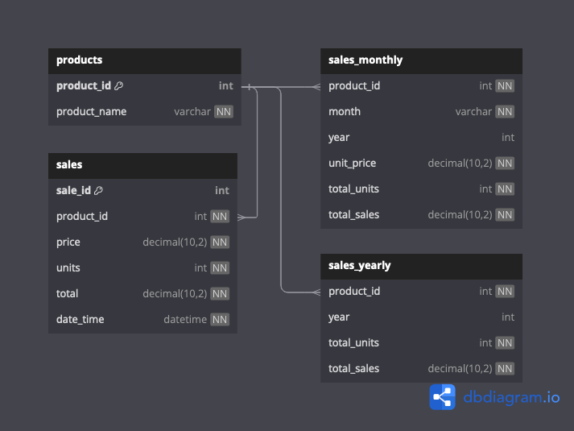

## Overview
This script processes sales data from an Excel file and stores it in a MySQL database. It handles data transformations, loads data into various database tables, and ensures robust error management throughout the process to maintain data integrity.

## Setup and Execution

### Prerequisites
- Python 3.x installed
- MySQL server running locally or remotely with necessary permissions and credentials
- Install relevant dependencies using:
  ```bash
  pip install -r requirements.txt
  ```

### Execution
To run the script, navigate to the script directory and use the following command:
```bash
python main.py --src [path_to_excel_file] --log-level [logging_level]

```
**Optional Arguments:**
- `--src`: Specify the path to the source Excel file. Default is "./input_data/Monthly_Sales_Data.xlsx".
- `--log-level`: Set the logging level to control output verbosity. Options include `DEBUG`, `INFO`, `WARNING`, `ERROR`, `CRITICAL`. Default is `INFO`.

Database configuration will be prompted once the script is executed. Enter the relevant connection details as per your setup.
```bash
Please enter your database connection details:
Host (default: localhost): 
Port (default: 3306): 
Username (default: root): 
Password (default: password): 
Database name (default: sales):
```

### Assumptions
- **Excel Format**: The script assumes that the Excel file is formatted with specific columns (Product, Unit Price, Sales Units, Total Sales) and sheets (January, February, etc.). Any deviation from this format may cause the script to fail.
- **Database Creation**: It is assumed that the database schema is already in place as expected by the script. The script does not handle creating the database itself, only the tables via SQLAlchemy’s ORM based on predefined models.
- **Year Handling**: The script currently uses a hardcoded year (2023) for all operations, since this information is not provided in the source data.
- **Data Provision**: Since individual sales data is not provided, only the summary tables are populated. This assumes that the script is designed to work with aggregated data rather than transactional records.

### Further Enhancements:
- **Dynamic Date Handling**: Modify the script to handle dates dynamically based on the data within the Excel file rather than using a hardcoded or command-line-provided year.
- **Automated Testing**: Implement unit tests and integration tests to validate the functionality across different environments and data sets.
- **Error Reporting**: Enhance error reporting features to provide more detailed diagnostics and to facilitate easier debugging.

## Database Design
The database consists of four main tables designed to store and manage product sales data effectively. Below is an overview of each table and its role within the system:



### 1. `products`
- **Description**: This table stores information about each product.
- **Fields**:
  - `product_id` (int, Primary Key): A unique identifier for each product.
  - `product_name` (varchar): The name of the product.

### 2. `sales`
- **Description**: Records individual sales transactions.
- **Fields**:
  - `sale_id` (int, Primary Key): A unique identifier for each sale.
  - `product_id` (int, Foreign Key): Links to the `product_id` in the `products` table.
  - `price` (decimal(10,2)): The price of the product per unit.
  - `units` (int): The number of units sold.
  - `total` (decimal(10,2)): The total cost of the sale (units * price).
  - `date_time` (datetime): The date and time when the sale was made.

### 3. `sales_monthly`
- **Description**: Aggregates sales data on a monthly basis.
- **Fields**:
  - `product_id` (int, Foreign Key): References the `product_id` in the `products` table.
  - `month` (varchar): The month of the aggregated sales.
  - `year` (int): The year of the aggregated sales.
  - `unit_price` (decimal(10,2)): The average unit price of the product for the month.
  - `total_units` (int): The total number of units sold during the month.
  - `total_sales` (decimal(10,2)): The total sales revenue for the product during the month.

### 4. `sales_yearly`
- **Description**: Aggregates sales data on a yearly basis.
- **Fields**:
  - `product_id` (int, Foreign Key): Links to the `product_id` in the `products` table.
  - `year` (int): The year of the aggregated sales.
  - `total_units` (int): The total number of units sold throughout the year.
  - `total_sales` (decimal(10,2)): The total sales revenue for the product during the year.

### Relationships
- The `sales` table is related to the `products` table through the `product_id` field.
- Both the `sales_monthly` and `sales_yearly` tables link back to the `products` table to provide a detailed breakdown of sales over different time frames.

This structured approach to database design facilitates complex queries and reports, supports data integrity, and simplifies the management of sales data across various dimensions (individual transactions, monthly summaries, and annual summaries).

